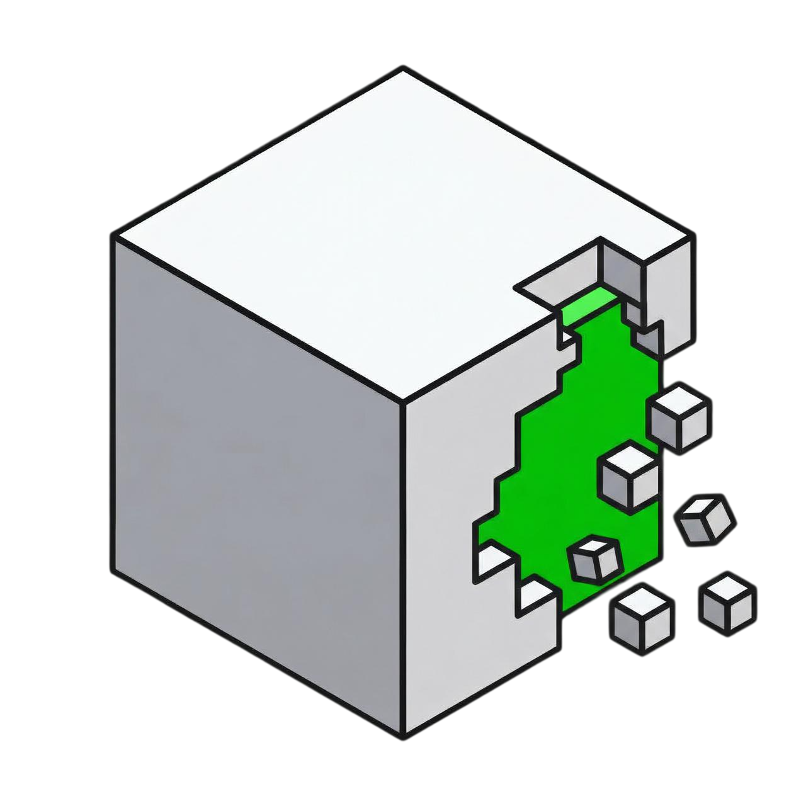

<p align="center">
  
</p>

<h1 align="center">brin</h1>
<p align="center">
  credit score for context
</p>

<p align="center">
  <a href="https://opensource.org/licenses/MIT"></a>
  &nbsp;
  <a href="https://www.ycombinator.com"></a>
  &nbsp;
  <a href="https://discord.gg/spZ7MnqFT4"></a>
  &nbsp;
  <a href="https://x.com/superagent_ai"></a>
  &nbsp;
  <a href="https://www.linkedin.com/company/superagent-sh/"></a>
</p>

---

ai agents are only as safe as the context they consume. brin scores each piece before your agent acts, detecting malware, prompt injection, phishing, and supply chain attacks across packages, repos, mcp servers, skills, and urls.

this dataset contains open-source threat scan records from brin's scoring pipeline. free for research, red-teaming, and model training.

- **docs:** [brin.sh/docs](https://brin.sh/docs)
- **cli:** [brin-cli](https://github.com/superagent-ai/brin-cli)
- **cursor plugin:** included in this repo (see [cursor plugin](#cursor-plugin) below)

---

## cursor plugin

this repo includes a [cursor plugin](https://cursor.com/docs/reference/plugins) that integrates brin's security scanning directly into your cursor workflow.

### what it does

- **pre-install hook** — automatically scans packages before `npm install`, `pip install`, `cargo add`, and other package manager commands. blocks `suspicious` or `malicious` packages and warns on `caution` verdicts.
- **brin-check skill** — invoke with `/brin-check` in agent chat to scan any package, repo, MCP server, domain, or skill on demand.
- **brin-scan command** — invoke with `/brin-scan <resource>` for a quick security check (e.g. `/brin-scan express`, `/brin-scan pypi:requests`).
- **security rules** — teaches the AI agent to always consider brin scores when suggesting dependencies or external resources.

### install

install the plugin from the cursor marketplace, or add it manually:

1. clone this repo into your cursor plugins directory, or
2. copy the plugin files into your project:

```
.cursor-plugin/plugin.json   # plugin manifest
hooks/hooks.json              # hook configuration
scripts/brin-check.sh         # pre-install check script
rules/brin-security.mdc       # AI agent security rules
skills/brin-check/SKILL.md    # brin scanning skill
commands/brin-scan.md         # brin scan command
```

3. make the hook script executable:

```bash
chmod +x scripts/brin-check.sh
```

4. restart cursor to load the plugin.

### supported package managers

| manager | commands matched |
|---------|-----------------|
| npm | `npm install`, `npm add`, `npm i`, `npx` |
| yarn | `yarn add`, `yarn install` |
| pnpm | `pnpm add`, `pnpm install`, `pnpm i` |
| bun | `bun add`, `bun install`, `bun i` |
| pip | `pip install`, `pip3 install`, `uv pip install`, `uv add` |
| cargo | `cargo add`, `cargo install` |
| gem | `gem install` |
| go | `go get`, `go install` |

### usage

the pre-install hook runs automatically. for manual scans, use:

- `/brin-check` — full security analysis with sub-scores and threat details
- `/brin-scan <resource>` — quick scan of a specific resource

---

## schema

each record is a single brin scan result. the fields are:

| field | type | description |
|-------|------|-------------|
| `origin` | string | source type: `npm`, `pypi`, `crate`, `domain`, `page`, `repo`, `skill`, `mcp`, `contributor` |
| `identifier` | string | identifier within the origin (e.g. `express`, `example.com`) |
| `version` | string | version or ref (optional) |
| `score` | integer | 0–100 safety score. higher is safer |
| `confidence` | string | `low`, `medium`, or `high` |
| `verdict` | string | `safe`, `caution`, `suspicious`, or `malicious` |
| `sub_scores` | object | breakdown across four dimensions (see below) |
| `threats` | array | detected threat signals with type and description (optional, omitted if none) |
| `scanned_at` | string | ISO 8601 timestamp of when the scan was run |

### sub_scores

| dimension | description |
|-----------|-------------|
| `identity` | publisher reputation, domain age, ownership signals |
| `behavior` | runtime behavior, network calls, install scripts |
| `content` | source code, prompt content, instruction analysis |
| `graph` | dependency graph, transitive risk, maintainer overlap |

### example record

```json
{
  "origin": "npm",
  "identifier": "express",
  "version": "4.18.2",
  "score": 81,
  "confidence": "medium",
  "verdict": "safe",
  "sub_scores": {
    "identity": 95.0,
    "behavior": 40.0,
    "content": 100.0,
    "graph": 30.0
  },
  "scanned_at": "2026-02-25T09:00:00Z"
}
```

---

## coverage

| origin | what is scored | threats detected |
|--------|---------------|-----------------|
| `npm` / `pypi` / `crate` | open source packages | install-time attacks, credential harvesting, typosquatting |
| `domain` / `page` | websites and web pages | prompt injection, phishing, cloaking, exfiltration via hidden content |
| `repo` | github repositories | agent config injection, malicious commits, compromised dependencies |
| `skill` | agent skills | description injection, output poisoning, instruction override |
| `mcp` | mcp servers | tool shadowing, schema abuse, silent capability escalation |
| `contributor` | github contributors | impersonation, typosquatting, suspicious commit patterns |

---

## format

records are stored as **jsonl** (newline-delimited json) - one record per line. this makes the dataset trivially streamable and parseable without loading everything into memory.

files are organized by origin under `data/`:

```
data/
  npm.jsonl
  pypi.jsonl
  crate.jsonl
  domain.jsonl
  page.jsonl
  repo.jsonl
  skill.jsonl
  mcp.jsonl
  contributor.jsonl
```

---

## contributing

see [CONTRIBUTING.md](CONTRIBUTING.md) for details.

---

## license

MIT

---

<p align="center">
  <sub>built by <a href="https://superagent.sh">superagent</a> - ai security for the agentic era</sub>
</p>
